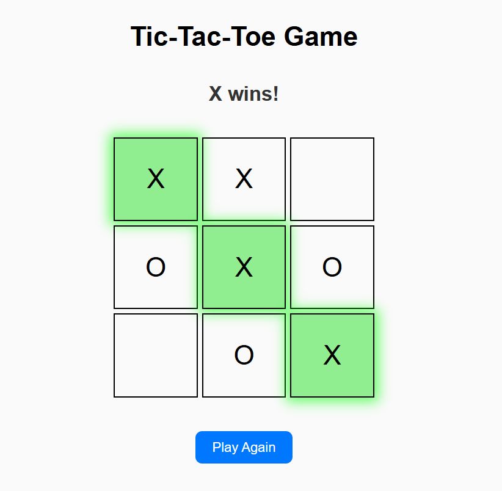

<section>
  <h1>Tic Tac Toe Game</h1>
  

    A classic <strong>Tic Tac Toe</strong> built with a Java backend (core game logic) and a simple web frontend using <strong>HTML, CSS, and JavaScript</strong>. Players click cells to make moves, see the active turn, and the app detects wins and draws automatically.
  

  

https://ishikacodespace.github.io/Tic-Tac-Toe-Game/  

  

</section>

<section>
  <h3>Features</h3>
  <ul>
    <li>Interactive 3×3 board with click-to-play moves</li>
    <li>Alternating X and O turns with status indicator</li>
    <li>Automatic win and draw detection (rows, columns, diagonals)</li>
    <li>Highlights the winning combination when the game ends</li>
    <li>Play Again / Reset to start a new round instantly</li>
    <li>Responsive UI with simple animations for a smooth feel</li>
  </ul>
  

</section>

<section>
  

    
  

  

</section>

<section>
  <h3>How to Run (Frontend)</h3>
  <ol>
    <li>Clone the repository:
      <pre><code class="language-bash">git clone https://github.com/ishikacodespace/Tic-Tac-Toe-Game.git
cd Tic-Tac-Toe-Game</code></pre>
    </li>
    <li>Open <code>index.html</code> in any modern browser (Chrome, Edge, Firefox, Safari).</li>
    <li>Click inside the grid to place marks; the game alternates turns and shows results.</li>
    <li>Press <em>Play Again</em> to reset the board.</li>
  </ol>
  

</section>

<section>
  <h3>How to Run (Java logic)</h3>
  

    If using the Java version of the core logic locally, compile and run the Java class from the project’s backend folder (or where they are located) using <code>javac</code> and <code>java</code>. A typical flow:
  

        <pre><code class="language-bash">
javac src/TicTacToe.java
java -cp src TicTacToe

</code></pre>
  

    The Java logic can be integrated with the frontend for AI, server validation, or multiplayer extensions.
  

  

</section>

<section>
  <h3>Technologies Used</h3>
  <ul>
    <li><strong>Java</strong> — core game logic and potential backend features</li>
    <li><strong>HTML</strong>, <strong>CSS</strong>, <strong>JavaScript</strong> — interactive browser UI</li>
  </ul>
  

</section>

<section>
  <h3>Notes</h3>
  <ul>
    <li>Current build runs fully client-side; Java logic is optional but useful for AI or server-side validation.</li>
    <li>UI is responsive and designed to work across desktop and mobile screens.</li>
  </ul>
</section>

